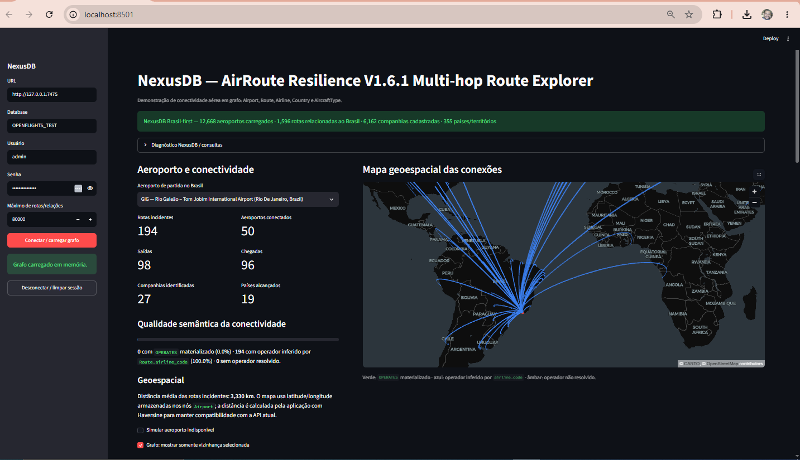
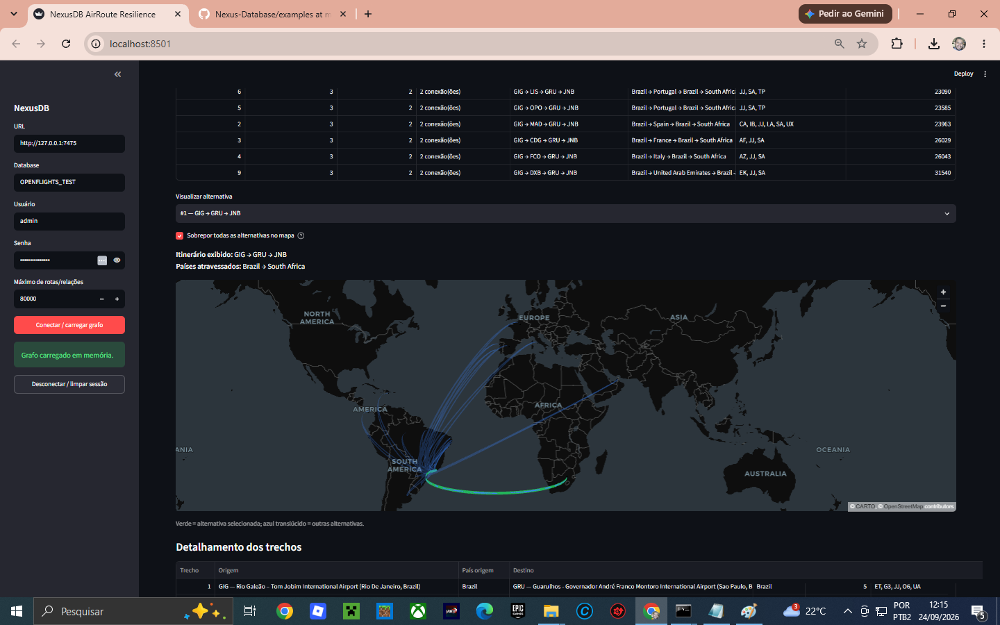

# NexusDB AirRoute Resilience --- Graph Analytics, Geospatial e Multi-hop Routing

Este exemplo demonstra o uso do **NexusDB** em um cenário de rede de
transporte aéreo, combinando **Property Graph**, **Graph Analytics com
CSR**, **consultas geoespaciais**, **análise de resiliência** e
**exploração de rotas com múltiplas conexões**.

A aplicação usa dados do **OpenFlights** importados para o NexusDB e uma
interface em **Streamlit** para explorar aeroportos, rotas, companhias
aéreas, países e tipos de aeronaves.

> **Importante:** os dados do OpenFlights representam conectividade
> declarada no dataset. Eles não devem ser interpretados como
> disponibilidade de voos em tempo real, frequência atual, preço,
> emissão de bilhetes ou garantia de que uma combinação de trechos possa
> ser comprada como um único itinerário.

> 
------------------------------------------------------------------------

## 1. Objetivo do exemplo

O objetivo não é apenas mostrar que o NexusDB consegue **armazenar um
grafo**. A demonstração explora diferentes capacidades do banco no mesmo
conjunto de dados:

-   armazenamento de um **Property Graph heterogêneo**;
-   execução de **Degree**, **PageRank**, **Connected Components** e
    **Shortest Path**;
-   execução dos algoritmos sobre a estrutura **CSR** do NexusDB;
-   consultas espaciais com **`ST_DWithin`** e índice **RTree**;
-   análise da conectividade de um aeroporto;
-   análise de impacto da indisponibilidade de aeroportos;
-   exploração de rotas diretas e com múltiplas conexões;
-   comparação entre um caminho semântico do domínio aéreo e o
    `shortestPath` do grafo completo.

------------------------------------------------------------------------

## 2. Arquitetura do exemplo

O fluxo dos algoritmos nativos de grafo utilizado nesta demonstração é:

``` text
Streamlit
   │
   │ HTTP /db/data/cypher
   ▼
NexusDB
   │
   ▼
data.rs
   │
   ▼
graph_routes.rs
   │
   ▼
graph_algorithms.rs
   │
   ▼
GraphView / CSR
```

A aplicação apresenta as queries `CALL` enviadas ao NexusDB e mede o
tempo observado pelo cliente HTTP.

Esse tempo inclui:

``` text
requisição HTTP
+ execução no NexusDB
+ serialização JSON
+ transferência da resposta
```

Portanto, ele não deve ser interpretado como tempo puro de CPU do
algoritmo.

------------------------------------------------------------------------

## 3. Modelo de dados

O exemplo utiliza o seguinte modelo conceitual:

``` text
(Airport)-[:LOCATED_IN]->(Country)

(Airline)-[:BASED_IN]->(Country)

(Airport)-[:DEPARTURE]->(Route)

(Route)-[:ARRIVAL]->(Airport)

(Airline)-[:OPERATES]->(Route)

(Route)-[:USES_AIRCRAFT]->(AircraftType)
```

A entidade `Route` é modelada como nó porque contém informações próprias
e pode se relacionar com aeroportos, companhias e tipos de aeronaves.

Entre suas propriedades estão:

``` text
route_key
airline_code
source_airport_id
destination_airport_id
codeshare
stops
equipment
```

Os aeroportos possuem, entre outras propriedades:

``` text
airport_id
name
city
country
iata
icao
latitude
longitude
altitude_ft
timezone_offset
dst
tz_database
type
source
```

------------------------------------------------------------------------

## 4. Conectividade e materialização do grafo

O exemplo diferencia o conhecimento disponível nas propriedades dos nós
da materialização explícita das relações.

Uma rota pode ter:

``` text
Route.source_airport_id
Route.destination_airport_id
Route.airline_code
```

mesmo quando algumas relações ainda não estiverem materializadas.

A interface classifica a informação de operador em três situações:

``` text
OPERATES materializado
Airline ──OPERATES──► Route

Operador inferido
Route.airline_code ──► Airline.iata / Airline.icao

Operador não resolvido
sem OPERATES e sem correspondência conhecida
```

Essa distinção permite visualizar dados parcialmente materializados sem
confundir uma associação inferida com uma relação efetivamente
armazenada no Property Graph.

------------------------------------------------------------------------

## 5. Graph Analytics no NexusDB / CSR

A aplicação executa diretamente no NexusDB:

``` cypher
CALL algo.degree();

CALL algo.pageRank(20);

CALL algo.connectedComponents();

CALL algo.shortestPath(1, 10);
```

Na interface, algumas consultas podem receber `LIMIT` para controlar a
quantidade de resultados transferidos ao dashboard.

### Degree

O Degree permite identificar nós com grande quantidade de conexões no
grafo.

Como o grafo é heterogêneo, o ranking global pode conter:

``` text
Airport
Country
Airline
AircraftType
Route
```

O dashboard também apresenta uma visão filtrada para `Airport`. Esse
filtro é apenas de **apresentação**: o algoritmo continua sendo
executado no NexusDB sobre o grafo.

### PageRank

O PageRank permite observar a importância estrutural dos nós
considerando não apenas o número de conexões, mas também a estrutura da
rede.

Exemplo:

``` cypher
CALL algo.pageRank(20);
```

O parâmetro `20` corresponde ao número de iterações utilizado no
exemplo.

### Connected Components

A consulta:

``` cypher
CALL algo.connectedComponents();
```

permite analisar a fragmentação do grafo e identificar componentes
conectados.

O dashboard apresenta, entre outros resultados, a quantidade de
componentes e o tamanho do maior componente retornado.

### Shortest Path

Para dois IDs internos do NexusDB:

``` cypher
CALL algo.shortestPath(source_id, target_id);
```

o NexusDB procura um caminho no grafo CSR.

É importante observar que esse caminho pertence ao **Property Graph
completo**. Portanto, ele pode atravessar nós como:

``` text
Airport
Route
Country
Airline
AircraftType
```

Isso é diferente de um itinerário aéreo, que precisa respeitar a
semântica `Airport → Route → Airport`.

------------------------------------------------------------------------

## 6. Consultas geoespaciais

O exemplo utiliza `ST_DWithin` para localizar aeroportos dentro de
determinado raio.

Exemplo conceitual:

``` cypher
MATCH (a:Airport)
WHERE ST_DWithin(a, longitude, latitude, distancia)
RETURN a
```

O filtro espacial é executado pelo NexusDB utilizando seu índice
espacial/RTree.

Na implementação usada neste exemplo, as coordenadas dos aeroportos
estão em SRID 4326. O dashboard converte aproximadamente:

``` text
raio em km
    ↓
km / 111.32
    ↓
raio angular aproximado
    ↓
ST_DWithin / RTree no NexusDB
    ↓
candidatos
    ↓
Haversine
    ↓
distância apresentada em km
```

Assim, o `ST_DWithin` é usado como pré-filtro espacial no banco e
Haversine refina a distância apresentada pela interface.

------------------------------------------------------------------------

## 7. Seleção de aeroporto e análise de conectividade

Ao carregar o dashboard, é possível selecionar um aeroporto e analisar:

-   rotas incidentes;
-   saídas;
-   chegadas;
-   aeroportos conectados;
-   companhias identificadas;
-   países alcançados;
-   distância média das rotas;
-   mapa geoespacial das conexões;
-   qualidade semântica das relações.

Por exemplo, ao selecionar o **GIG --- Rio Galeão**, a interface
constrói sua vizinhança e apresenta as conexões conhecidas no dataset.

------------------------------------------------------------------------

## 8. Planejador Multi-hop

A partir da versão **V1.6**, o exemplo permite escolher qualquer
aeroporto carregado como origem.

O destino pode ser definido como:

1.  um aeroporto específico; ou
2.  qualquer aeroporto de determinado país.

O número máximo de níveis também pode ser configurado.

``` text
1 nível
Origem ─────────────► Destino
voo direto

2 níveis
Origem ──► Conexão ──► Destino
1 conexão

3 níveis
Origem ──► Conexão ──► Conexão ──► Destino
2 conexões
```

A versão atual permite explorar até vários níveis, conforme configurado
na interface.

------------------------------------------------------------------------

## 9. Exemplo: Paraguai → Portugal

Um caso de uso é selecionar um aeroporto do Paraguai como origem e
Portugal como país de destino.

Exemplo de configuração:

``` text
Origem:
ASU — Silvio Pettirossi International Airport

Destino:
Qualquer aeroporto de Portugal

Máximo de níveis:
3
```

O planejador procura primeiro conexões diretas e depois caminhos com
escalas, respeitando:

``` text
Route.source_airport_id
        ↓
Route.destination_airport_id
```

Os resultados podem conter diferentes aeroportos intermediários
dependendo das rotas presentes no dataset.

Para cada alternativa são apresentados:

-   número de trechos;
-   número de conexões;
-   sequência de aeroportos;
-   países atravessados;
-   companhias/códigos associados;
-   distância geográfica aproximada;
-   detalhamento de cada trecho;
-   representação no mapa.

------------------------------------------------------------------------

## 10. Exemplo: Brasil → África do Sul

Outro exemplo é procurar caminhos entre um aeroporto brasileiro e um
aeroporto da África do Sul.

Uma alternativa pode ter a forma:

``` text
GIG → GRU → JNB
```

representando:

``` text
Brasil → Brasil → África do Sul
```

Enquanto outra alternativa poderia envolver outros aeroportos e países,
desde que essas ligações existam nas `Route` carregadas.

### Visualização das alternativas

A versão **V1.6.1** corrige a visualização do planejador para evitar
misturar caminhos diferentes.

Por padrão, o mapa mostra **somente a alternativa selecionada**.

``` text
Alternativa selecionada

GIG ──► GRU ──► JNB
```

A opção:

``` text
Sobrepor todas as alternativas no mapa
```

permite visualizar simultaneamente os demais caminhos encontrados.

Nesse modo:

``` text
verde             = alternativa selecionada
azul translúcido  = demais alternativas
```

Isso evita interpretar um arco pertencente a outra alternativa como
parte do itinerário atualmente selecionado.

------------------------------------------------------------------------

## 11. Route Planning semântico × Shortest Path CSR

Esse é um dos pontos centrais do exemplo.

### Planejamento semântico

Para construir um itinerário aéreo, o dashboard utiliza:

``` text
Airport A
   │
   ▼
Route
   │
   ▼
Airport B
   │
   ▼
Route
   │
   ▼
Airport C
```

ou, pelas propriedades:

``` text
source_airport_id → destination_airport_id
```

Assim, países, companhias e tipos de aeronaves não são interpretados
como escalas.

### Shortest Path nativo

O NexusDB pode executar:

``` cypher
CALL algo.shortestPath(source_internal_id, target_internal_id);
```

sobre o CSR do Property Graph completo.

Dessa forma, a aplicação permite demonstrar duas perguntas diferentes:

``` text
Qual é um itinerário possível entre aeroportos?
                    │
                    └──► Route Planning semântico

Qual é o menor caminho estrutural entre dois nós?
                    │
                    └──► NexusDB shortestPath / CSR
```

Essa diferença é importante em grafos heterogêneos.

------------------------------------------------------------------------

## 12. Análise de resiliência

O dashboard também permite estudar o impacto da indisponibilidade de um
aeroporto.

A ideia é observar como a remoção lógica de um ponto da rede pode
afetar:

-   rotas incidentes;
-   destinos;
-   conectividade;
-   caminhos alternativos;
-   companhias relacionadas;
-   países alcançados.

Combinada aos algoritmos de grafo, essa funcionalidade permite utilizar
o exemplo para estudos de **resiliência de redes de transporte**.

------------------------------------------------------------------------

## 13. Executando o exemplo

### Requisitos

-   NexusDB em execução;
-   banco OpenFlights previamente importado;
-   Python;
-   Streamlit;
-   dependências presentes em `requirements.txt`.

Instale as dependências:

``` bash
python -m pip install -r requirements.txt
```

Execute:

``` bash
python -m streamlit run app.py
```

Exemplo de configuração:

``` text
URL:       http://127.0.0.1:7475
Database:  OPENFLIGHTS_TEST
Usuário:   admin
```

A senha deve corresponder ao usuário configurado no NexusDB.

------------------------------------------------------------------------

## 14. Fluxo sugerido para demonstração

Uma sequência útil para apresentar o projeto é:

``` text
1. Conectar ao OPENFLIGHTS_TEST
              ↓
2. Selecionar um aeroporto
              ↓
3. Visualizar conexões no mapa
              ↓
4. Executar Degree
              ↓
5. Executar PageRank
              ↓
6. Analisar Connected Components
              ↓
7. Consultar aeroportos em um raio de 500 km
              ↓
8. Abrir o Planejador Multi-hop
              ↓
9. Escolher origem e destino
              ↓
10. Comparar voo direto e conexões
              ↓
11. Comparar com shortestPath CSR
              ↓
12. Simular impacto/resiliência
```

Essa sequência demonstra que o NexusDB participa de diferentes etapas da
análise e não apenas da persistência dos dados.

------------------------------------------------------------------------

## 15. Capacidades demonstradas

  -----------------------------------------------------------------------
  Área                                Demonstração
  ----------------------------------- -----------------------------------
  Property Graph                      Airport, Route, Airline, Country e
                                      AircraftType

  Persistência                        dados OpenFlights armazenados no
                                      NexusDB

  Degree                              `CALL algo.degree()`

  PageRank                            `CALL algo.pageRank(20)`

  Connected Components                `CALL algo.connectedComponents()`

  Shortest Path                       `CALL algo.shortestPath(a, b)`

  CSR                                 estrutura utilizada pelos
                                      algoritmos nativos

  Geospatial                          `ST_DWithin`

  Índice espacial                     RTree

  Mapas                               PyDeck

  Multi-hop                           rotas diretas e com conexões

  Resiliência                         impacto da indisponibilidade de
                                      aeroportos

  Semântica                           diferença entre relação
                                      materializada, inferida e não
                                      resolvida
  -----------------------------------------------------------------------

------------------------------------------------------------------------

## 16. Estrutura do projeto

``` text
.
├── app.py
├── graph_builder.py
├── nexus_client.py
├── requirements.txt
└── README.md
```

### `app.py`

Interface Streamlit, mapas, Graph Analytics, consultas geoespaciais,
resiliência e planejador Multi-hop.

### `nexus_client.py`

Cliente HTTP utilizado para comunicação com o NexusDB.

### `graph_builder.py`

Funções auxiliares para construção e visualização dos subgrafos.

------------------------------------------------------------------------

## 17. Limitações

Este exemplo deve ser interpretado como uma demonstração técnica.

O dataset utilizado não representa necessariamente a malha aérea
operacional atual. Além disso:

-   uma rota declarada não significa que exista voo disponível no
    momento;
-   uma sequência de rotas não garante conexão comercial entre os voos;
-   horários e tempos mínimos de conexão não são considerados;
-   preço e disponibilidade não são considerados;
-   requisitos de visto e imigração não são considerados;
-   codeshare pode exigir interpretação adicional;
-   as distâncias geográficas são usadas para análise e visualização,
    não para navegação aeronáutica.

------------------------------------------------------------------------

## 18. Possíveis evoluções

Algumas extensões naturais deste exemplo são:

-   `shortestPath` com restrição de labels e tipos de relacionamento;
-   caminhos `Airport → Route → Airport` diretamente no CSR;
-   Dijkstra com distância geográfica como peso;
-   menor número de conexões;
-   menor distância total;
-   custo composto distância + conexões;
-   `k-shortest paths`;
-   análise de hubs;
-   betweenness centrality;
-   detecção de comunidades;
-   análise de impacto antes/depois da remoção de aeroportos;
-   comparação de desempenho entre algoritmos;
-   distância geodésica nativa para SRID 4326;
-   execução de filtros espaciais combinados com Graph Analytics.

------------------------------------------------------------------------

## 19. Tecnologias

-   **NexusDB**
-   **Rust**
-   **CSR --- Compressed Sparse Row**
-   **Property Graph**
-   **Python**
-   **Streamlit**
-   **PyDeck**
-   **OpenFlights**
-   **RTree**
-   **Graph Analytics**
-   **Geospatial Analytics**

------------------------------------------------------------------------

## 20. Propósito

Este projeto serve como exemplo de aplicação do NexusDB em um problema
real de redes complexas, mostrando como uma mesma base pode ser
utilizada para:

``` text
armazenar
   +
relacionar
   +
consultar
   +
analisar grafos
   +
executar algoritmos CSR
   +
realizar consultas espaciais
   +
explorar caminhos
   +
avaliar resiliência
```

O resultado é uma demonstração integrada de **Graph Database + Graph
Analytics + Geospatial + Route Exploration** utilizando o NexusDB.
