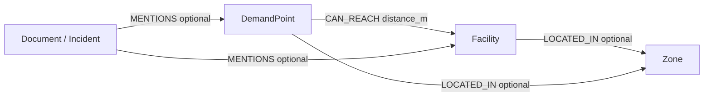

# GeocodeBR + City2Graph + NexusDB

This example shows how three complementary tools can be combined in a reproducible urban graph workflow for Brazil:

- **geocodebr** converts Brazilian addresses or CEPs into coordinates using open CNEFE/IBGE data.
- **City2Graph** turns geospatial observations into homogeneous or heterogeneous graph relations such as proximity, accessibility and metapaths.
- **NexusDB** persists the resulting property graph and exposes graph algorithms, Cypher-like queries, vector search and GraphRAG-oriented retrieval through an HTTP API.

The goal is not to replace geocodebr or City2Graph. NexusDB is the persistent analytical layer after graph construction.

## Why this integration is useful

A typical geospatial notebook stops after producing a GeoDataFrame or an in-memory NetworkX/PyG graph. That is ideal for exploration and model training, but it becomes less convenient when the graph must be queried repeatedly, shared by multiple applications, combined with other domains, enriched incrementally or used by an LLM.

This example converts a spatial accessibility problem into a persistent heterogeneous graph:

```text
Brazilian addresses / CEPs
        |
        v
    geocodebr
 CNEFE / IBGE coordinates
        |
        v
  GeoDataFrames
        |
        v
   City2Graph
 fixed-radius / kNN
        |
        v
 heterogeneous graph
        |
        v
      NexusDB
        |
        +--> persistent nodes + relationships
        +--> Degree / PageRank / Components / Shortest Path
        +--> Cypher-like queries
        +--> Vector Search
        +--> GraphRAG context
```

The City2Graph paper explicitly identifies scaling limitations in its current in-memory/Python workflow and mentions graph databases, batch processing and memory-efficient structures as useful future directions. NexusDB is a natural experimental backend for that next step.

## Demonstration scenario

The example models **urban service accessibility**.

Two semantic layers are used:

- `DemandPoint`: residential or administrative demand locations.
- `Facility`: health, education, food, emergency or other service locations.

City2Graph creates directed `CAN_REACH` edges from demand points to facilities within a configurable radius. The resulting graph is imported into NexusDB.

Once persisted, questions change from purely spatial calculations into graph questions:

- Which facilities are reachable by the largest number of demand points?
- Which demand points have no facility inside the radius?
- Which facilities are structurally central?
- Do disconnected service regions exist?
- Which locations depend on only one service hub?
- What other urban entities are connected to the same facility?
- Which documents or incidents refer to those locations?

That last group of questions is where the combination with GraphRAG becomes particularly useful.

## Why the example has an offline fixture

`geocodebr` downloads CNEFE-derived reference data on first use. The package cache can exceed 1 GB depending on the functions and fields used.

For this reason, the demo has two modes:

1. **fixture mode** — reproducible, no geocoding download required;
2. **geocodebr mode** — reads a CSV containing Brazilian CEPs and obtains real coordinates through `geocodebr.busca_por_cep()`.

The graph and NexusDB parts are identical after the geocoding stage.

## Requirements

Python 3.10+ is recommended.

```bash
python -m pip install -r requirements.txt
```

Start NexusDB locally before running the import:

```text
http://127.0.0.1:7474
```

The script reads credentials from:

```text
NEXUSDB_USER
NEXUSDB_PASSWORD
NEXUSDB_URL
```

Example on Windows PowerShell:

```powershell
$env:NEXUSDB_USER = "admin"
$env:NEXUSDB_PASSWORD = "your-password"
$env:NEXUSDB_URL = "http://127.0.0.1:7474"

python demo.py
```

## Run with the deterministic fixture

```bash
python demo.py
```

The fixture uses synthetic urban-service points in a metric CRS only to make the graph construction reproducible. It does **not** represent real public facilities or real demand.

The script:

1. creates demand and facility GeoDataFrames;
2. creates a heterogeneous proximity relation with City2Graph;
3. creates a fresh NexusDB database;
4. bulk-imports nodes;
5. bulk-imports `CAN_REACH` relationships;
6. runs Degree, PageRank and Connected Components;
7. writes a JSON report to `output/report.json`.

## Run with real Niterói POIs

First generate the current municipal POI CSV from the public SIGeo ArcGIS layers:

```bash
python download_niteroi_pois.py
```

Then load the real POIs, construct a City2Graph fixed-radius proximity graph
and persist the result in NexusDB:

```bash
python demo.py --poi-csv niteroi_pois.csv --radius-m 1200
```

In this mode, every CSV row becomes a `POI` node with properties such as
`category`, `name`, `address`, `bairro`, `cep`, `latitude`,
`longitude`, `source` and `source_layer`.

The importer also creates one `Bairro` node for each distinct bairro label
present in the municipal source and links POIs with:

```text
(POI)-[:LOCATED_IN]->(Bairro)
```

This assignment is intentionally conservative: `LOCATED_IN` is created only
from the source `bairro` attribute. The demo does not infer administrative
boundaries from point coordinates.

City2Graph constructs POI-to-POI proximity. NexusDB stores one deterministic
`NEAR` relationship per unordered POI pair, including the Euclidean distance
in metres and the radius used to construct the graph.

Example conceptual graph:

```text
Hospital A ── NEAR 540 m ── School B
    |                          |
    |                          └── LOCATED_IN ── Bairro Centro
    |
    ├── NEAR 810 m ── Cultural Facility C
    |
    └── LOCATED_IN ── Bairro Centro
```

After import, the demo runs Degree, PageRank and Connected Components and
writes the results to `output/report.json`.


The report also includes a `bairro_summary` section with the number of POIs,
the number of distinct service categories and the category list for each bairro.
This makes it possible to identify areas with low service diversity directly
from a reproducible JSON output before adding more advanced Cypher queries.

Example:

```json
{
  "bairro_summary": {
    "Centro": {
      "poi_count": 42,
      "category_count": 7,
      "categories": ["culture", "education_municipal", "health", "hospital"]
    }
  }
}
```

The numbers above are illustrative; the actual values are produced from the
downloaded SIGeo dataset.

The current implementation intentionally treats `NEAR` as straight-line
metric proximity. It must not be interpreted as pedestrian or transit
accessibility. A later version can replace or complement these edges with
street-network/GTFS metapaths from City2Graph.

## Run with geocodebr

Create a CSV such as:

```csv
external_id,kind,cep,category,name
D001,demand,20071-001,demand,Demand point 1
F001,facility,20071-001,health,Facility 1
```

Then run:

```bash
python demo.py --geocode-csv addresses.csv --radius-m 1500
```

The script calls:

```python
from geocodebr import busca_por_cep

result = busca_por_cep(
    cep=ceps,
    h3_res=9,
    resultado_gpd=False,
    verboso=False,
)
```

A CEP may resolve to more than one CNEFE row. The demo collapses each CEP to one representative point by averaging its returned coordinates. For analytical production use, choose a domain-specific disambiguation rule instead of blindly averaging.

The geocodebr output is in SIRGAS 2000 (EPSG:4674). Before distance calculations, the example reprojects the points to SIRGAS 2000 / UTM zone 23S (EPSG:31983), appropriate for this Rio de Janeiro-oriented demonstration. Use the appropriate projected CRS for another part of Brazil.

## City2Graph relation

The core heterogeneous spatial relation is:

```python
_, access_edges = city2graph.fixed_radius_graph(
    demand_gdf,
    radius=radius_m,
    distance_metric="euclidean",
    target_gdf=facility_gdf,
)
```

Using `target_gdf` makes the relation directed:

```text
DemandPoint --CAN_REACH--> Facility
```

The distance becomes an edge property:

```json
{
  "type": "CAN_REACH",
  "properties": {
    "distance_m": 742.4
  }
}
```

This follows the same heterogeneous-graph principle described by City2Graph: semantically different entities remain different node types, while explicit edge types describe the urban relation.

## NexusDB graph model



The demo imports the first relation. The remaining relations show natural extensions.

### Example NexusDB queries

Graph algorithms:

```cypher
CALL algo.degree();
CALL algo.pageRank(20);
CALL algo.connectedComponents();
```

A persisted graph can also support multi-hop traversal and GraphRAG-oriented retrieval after adding operational, demographic or documentary layers.

For example, a future graph could contain:

```text
Document
   |
   v
DemandPoint
   |
   +-- CAN_REACH --> Facility
   |                   |
   |                   +--> ServiceType
   |
   +--> CensusArea
          |
          +--> Population
          +--> VulnerabilityIndicator
```

A natural-language question such as:

> Which vulnerable demand areas depend on only one health facility, and what evidence supports the classification?

can be decomposed into semantic retrieval plus graph traversal. The LLM explains the returned evidence; it does not need to invent the relationships.

## What NexusDB adds

| Stage | Tool | Responsibility |
|---|---|---|
| Address resolution | geocodebr | Brazilian address/CEP -> coordinates |
| Spatial graph construction | City2Graph | proximity, morphology, transport, mobility, metapaths |
| Persistent graph | NexusDB | nodes, typed relationships, properties |
| Structural analytics | NexusDB | Degree, PageRank, components, shortest path, community methods |
| Semantic retrieval | NexusDB | native vector index / HNSW |
| Grounded QA | NexusDB + LLM | GraphRAG context + natural-language explanation |

The important advantage is **composition**. A City2Graph relation can become only one layer of a larger persistent graph. Administrative records, supply chains, incidents, contracts, documents, people or sensor data can be linked to the same urban entities.

## Relation to the City2Graph paper

The 2026 City2Graph paper demonstrates heterogeneous graphs across morphology, transportation, mobility and proximity. It also introduces metapaths that collapse multi-step typed relations into higher-order semantic connections such as 15-minute accessibility.

The Liverpool case study combines three relations between census areas:

- spatial contiguity;
- 15-minute walking accessibility;
- 15-minute multimodal accessibility.

This example adopts the same principle at a smaller scale: **the relation type is part of the analytical meaning**. A `CAN_REACH` edge is not just a generic connection.

The paper also reports that heterogeneous models produced more structurally coherent functional clusters than a homogeneous contiguity-only model, reinforcing the value of preserving relation types rather than flattening the city into one network.

## Important limitations

This repository and the NexusDB HA layer are experimental. This example is intended for research, benchmarking and controlled demonstrations.

The fixture is synthetic. The geocodebr mode uses real CNEFE-derived coordinates, but geocoding quality, ambiguity and uncertainty must be assessed before policy or operational use.

Straight-line proximity is not equivalent to pedestrian travel time. For a true accessibility study, use a street/transport network and network distance, GTFS, or City2Graph metapaths instead of interpreting Euclidean radius as travel time.

## References

- geocodebr — Ipea: https://ipea.github.io/geocodebr/
- City2Graph documentation: https://city2graph.net/latest/
- Sato, Y., Pietrostefani, E., Mahabir, R., & Arribas-Bel, D. (2026). *City2Graph: A Python library for Heterogeneous Graph Neural Networks and spatial analysis in urban systems*. Computers, Environment and Urban Systems, 130, 102492. https://doi.org/10.1016/j.compenvurbsys.2026.102492
